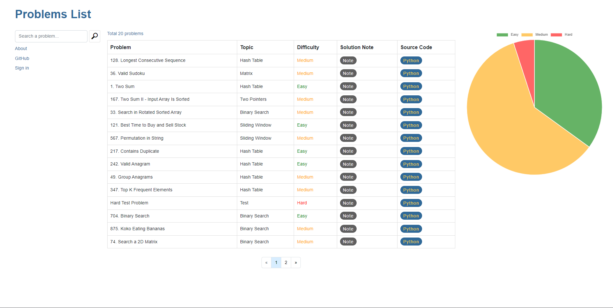

# LeetCode Dashboard

## Project Structure

```
.
├── manage.py
├── problems_list        # main app
│   ├── __init__.py
│   ├── admin.py
│   ├── apps.py
│   ├── context_processors.py
│   ├── models.py
│   ├── migrations/
│   ├── templates
│   │   └── problems_list/
│   ├── templatetags/
│   ├── tests.py
│   ├── urls.py
│   └── views.py
├── requirements.txt
├── src                 # project directory   
│   ├── __init__.py
│   ├── asgi.py
│   ├── settings.py
│   ├── urls.py
│   └── wsgi.py
├── static
│   ├── bootstrap/
│   ├── css/
│   └── js/
└── templates/
```

## Setup
```
$ pip install -r requirements.txt
$ python3 manage.py runserver
$ python3 manage.py makemigrations
$ python3 manage.py migrate
$ python3 manage.py createsuperuser
```

## Screenshot


